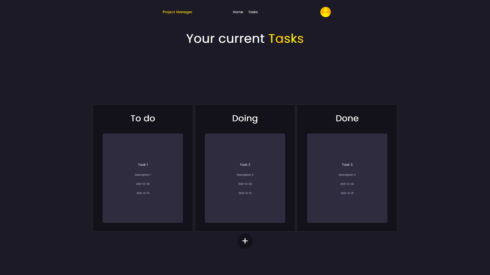

# PHP Project Manager
This is a simple project manager made using php and multiple colaborators for a school project

## Current Features

- Create an account
- Log in your account
- Create tasks
- Assign tasks as:
    - Todo
    - Doing
    - Done

## Planned Features

- Add collaborators to a project
- Add collaborators to a task
- Add a project

## Screenshots

